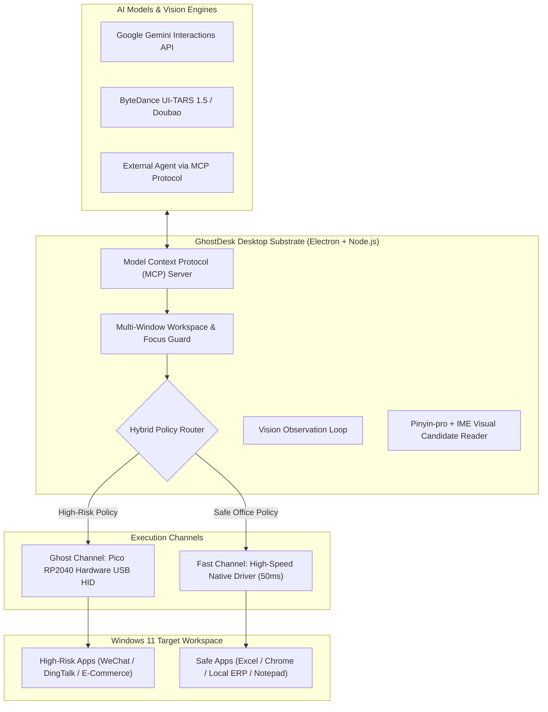

# GhostDesk 👻🖥️⚡

> **The Open-Source Hardware-in-the-Loop Desktop AI Employee Substrate for Windows**  
> *攻壳机动队式软硬协同·物理级防封的桌面 AI 员工开源底座*

[](LICENSE)
[](https://www.microsoft.com/windows)
[](https://www.raspberrypi.com/products/raspberry-pi-pico/)
[](https://ai.google.dev/)

[English](README.md) | [中文说明](README_CN.md)

---

## 💡 What is GhostDesk? / 什么是 GhostDesk？

Most modern Computer Use and RPA frameworks (e.g., PyAutoGUI, Windows Accessibility APIs, OS-level hooks) rely on **software input injection**. When automating sensitive enterprise applications (such as WeChat, DingTalk, Feishu, e-commerce stores, ERPs, and banking clients), software hooks are quickly detected by anti-bot and anti-fraud systems, leading to instant account bans.

**GhostDesk** ("Ghost in the Machine for your Desktop") introduces a production-grade **Hardware-in-the-Loop (HITL)** architecture:
1. **Physical Hardware HID Emulation (RP2040 Pico)**: The AI controls a dedicated Raspberry Pi Pico hardware dongle running custom TinyUSB firmware. To Windows and target software, input appears as an authentic physical USB keyboard and mouse.
2. **Vision-Driven IME Chinese Typing**: Converts text to full pinyin, simulates individual ASCII keystrokes, and visually OCRs/reads the IME candidate popups in real-time. **Zero clipboard hijacking, zero `Ctrl+V` signatures**.
3. **Hybrid Execution (Fast Path + Ghost Path)**:
   - **Ghost Channel**: Physical Pico USB + VLM OCR candidate typing for high-risk targets (WeChat, DingTalk, Pinduoduo).
   - **Fast Channel**: Instant native typing & direct automation for low-risk office tools (Excel, Chrome, Notepad), cutting typing latency from 15s to 50ms and saving ~80% VLM tokens!
4. **Multi-Window Workspace Guard**: Allows switching between an authorized whitelist of application windows (e.g. WeChat + Chrome + Excel) while fail-closing on unexpected popups.
5. **Model Context Protocol (MCP) Server**: Exposes standard MCP tools (`ghostdesk_act`, `ghostdesk_list_workspace_windows`, `ghostdesk_switch_focus`) for external Agent orchestration.
6. **Dual Vision Computer Use Engines**:
   - Native **Google Gemini Interactions** desktop Computer Use.
   - Open-source **ByteDance UI-TARS 1.5** / Doubao model support.

---

## 🏗️ Architecture / 核心架构



---

## ⚡ Quick Start / 快速上手

### 1. Prerequisites
- **OS**: Windows 11 x64
- **Node.js**: v20+ / npm v10+
- *(Optional for Hardware Mode)*: Raspberry Pi Pico 1 (RP2040) board + Micro-USB cable

### 2. Installation
```powershell
# Clone the repository
git clone https://github.com/AIMarshallLee/GhostDesk.git
cd GhostDesk

# Install dependencies
npm ci

# Run test suite (230+ comprehensive tests)
npm test
```

### 3. Launching
- **Web Studio (Browser UI)**:
  ```powershell
  npm run dev
  # Open http://127.0.0.1:5178
  ```
- **Desktop Application (Electron)**:
  ```powershell
  npm run desktop
  ```
- **Developer Software-Only Mode (No Hardware Needed)**:
  ```powershell
  $env:FLOWDESK_DEV_MODE="1"; npm run desktop
  ```

---

## 🔌 Hardware Setup (30-Second Flashing) / 硬件烧录

GhostDesk uses the standard **Raspberry Pi Pico 1 (RP2040)**:
1. Hold down the **BOOTSEL** button on your Pico and plug it into your computer via USB.
2. A mass storage drive named `RPI-RP2` will appear.
3. Drag and drop `firmware/release/flowdesk_usb_bridge.uf2` onto the `RPI-RP2` drive.
4. The Pico will automatically reboot as a GhostDesk USB HID controller.
5. In GhostDesk Desktop, go to **USB Hardware** settings; the device will be auto-detected!

---

## 🗺️ Roadmap: Growing into an AI Employee Substrate

- [x] **v0.7.0 (Current Baseline)**:
  - Gemini Native Interactions Computer Use
  - UI-TARS 1.5 single-task operator
  - Raspberry Pi Pico USB HID protocol 4
  - Vision IME Chinese full-pinyin typing
- [x] **v0.8.0 (Substrate Milestone 1 - Live Now!)**:
  - **Hybrid Execution Engine**: Fast Path (50ms typing) + Ghost Path (Pico hardware anti-ban)
  - **Multi-Window Workspace Scope**: Focus switching with HWND whitelist validation
  - **Model Context Protocol (MCP) Server**: Standard tool interface for agentic control
- [ ] **v0.9.0 (Agent Skill Ecosystem)**:
  - Modular skill directory (Excel, browser multi-tab, invoice parsing, ERP entry)
  - Long-horizon planning & self-reflection engine
- [ ] **v1.0.0 (Enterprise Multi-Agent Cluster)**:
  - Local multi-device dispatching console for managing fleets of hardware-dongle AI workers

---

## 🤝 Contributing & License

Contributions are welcome! Please feel free to submit issues and pull requests.

This project is licensed under the **Apache License 2.0** - see the [LICENSE](LICENSE) file for details.  
Firmware includes TinyUSB components subject to MIT/BSD licensing (see `firmware/licenses`).
