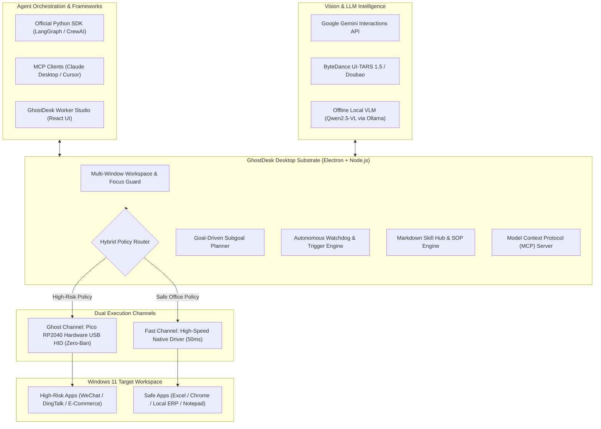

# GhostDesk 👻🖥️⚡

> **The Open-Source Hardware-in-the-Loop Desktop AI Employee Substrate for Windows**  
> *攻壳机动队式软硬协同·物理级防封的桌面 AI 员工开源底座*

[](LICENSE)
[](https://www.microsoft.com/windows)
[](https://www.raspberrypi.com/products/raspberry-pi-pico/)
[](https://ai.google.dev/)
[](https://modelcontextprotocol.io/)
[](sdk/python/)

[English](README.md) | [中文说明](README_CN.md)

---

## 💡 What is GhostDesk? / 什么是 GhostDesk？

Most modern Computer Use and RPA frameworks (such as PyAutoGUI, Windows UI Automation, and OS-level hooks) rely on **software input injection**. When automating sensitive enterprise applications (e.g. WeChat, DingTalk, Feishu, e-commerce admin panels, ERPs, and banking software), software hooks are detected within seconds by anti-bot and anti-fraud engines, leading to immediate account bans.

**GhostDesk** ("Ghost in the Machine for your Desktop") introduces an enterprise-grade **Hardware-in-the-Loop (HITL)** substrate:

1. 🛡️ **Physical Hardware HID Emulation (RP2040 Pico)**: AI keystrokes and mouse movements are piped through an external hardware microchip running custom TinyUSB firmware. To Windows and target software, input appears as an authentic external USB keyboard and mouse. **Zero API hooks, zero anti-cheat detection.**
2. ⚡ **Hybrid Fast/Ghost Channel Routing**:
   - **Ghost Channel**: Pico USB HID + VLM OCR candidate typing for high-risk targets (WeChat, DingTalk, Pinduoduo).
   - **Fast Channel**: Instant native typing & direct automation for safe productivity tools (Excel, Chrome, Notepad), cutting typing latency from 15s to 50ms and saving ~80% VLM tokens!
3. 🔒 **100% Offline Local VLM Adapter (Qwen2.5-VL / Ollama)**: Zero data leakage. Run entirely offline on local enterprise GPUs using Ollama or vLLM with automated coordinate scaling.
4. 🐍 **Official Python SDK (`ghostdesk`)**: Seamlessly connects to **LangGraph**, **CrewAI**, **AutoGen**, and LangChain with typed Pydantic models.
5. 📑 **Markdown SOP Community Skill Hub**: Write enterprise automation procedures in human-readable Markdown SOPs. No code required. Built-in SOPs include *Feishu Leave Approval*, *Tax Invoice Batch Export*, *Xiaohongshu Lead Capture*, and *WeChat Order to Excel*.
6. 🤖 **Autonomous Worker Studio & Self-Healing Watchdog**: Visual React dashboard for monitoring workers, token savings metrics, interval/file-watcher autonomous triggers, and automatic `ESC` self-healing on modal blockage.
7. 🔌 **Model Context Protocol (MCP) Server**: Standard MCP tool endpoints for Claude Desktop, Cursor, and any external agent orchestrator.

---

## 🏗️ Architecture / 核心架构



---

## ⚡ Quick Start / 快速上手

### 1. Prerequisites
- **OS**: Windows 11 x64
- **Node.js**: v20+ / npm v10+
- **Python (Optional for SDK)**: Python 3.10+
- *(Optional for Hardware Mode)*: Raspberry Pi Pico 1 (RP2040) board + Micro-USB cable (~$3-4)

### 2. Installation
```powershell
# Clone the repository
git clone https://github.com/AIMarshallLee/GhostDesk.git
cd GhostDesk

# Install dependencies
npm ci

# Run test suite (43+ substrate unit tests)
npm test
```

### 3. Launching
- **Worker Studio (Desktop App)**:
  ```powershell
  npm run desktop
  ```
- **Developer Software-Only Mode (No Hardware Needed)**:
  ```powershell
  $env:FLOWDESK_DEV_MODE="1"; npm run desktop
  ```
- **Local MCP Server**:
  ```powershell
  npx tsx desktop/mcp-server.ts
  ```

---

## 🐍 Python SDK Quickstart (LangGraph & CrewAI)

Install and run the Python SDK:
```powershell
cd sdk/python
pip install -e .
```

### Basic Usage
```python
from ghostdesk import GhostClient, WindowTarget

client = GhostClient(base_url="http://127.0.0.1:4318")

# 1. High-risk app: Automatically routed to Pico USB Hardware HID
res = client.execute_action(process="wechat.exe", kind="type_text", text="订单已发货！")
print(f"Executed via: {res.channel}")  # -> 'ghost'

# 2. Safe app: Routed to Fast Channel (50ms native speed)
res = client.execute_action(process="excel.exe", kind="click", x=120.0, y=85.0)
print(f"Executed via: {res.channel}")  # -> 'fast'

# 3. Autonomous SOP Skill execution
res = client.dispatch_skill(
    skill_id="skill_order_to_excel",
    target_windows=[
        WindowTarget(hwnd="0x001A", process="wechat.exe", title="WeChat"),
        WindowTarget(hwnd="0x002B", process="excel.exe", title="OrderSheet.xlsx"),
    ]
)
```

See [sdk/python/examples/](sdk/python/examples/) for complete **LangGraph** and **CrewAI** worker integration scripts.

---

## 📑 Markdown SOP Skill Hub

Create enterprise skills in plain Markdown without programming:

```markdown
---
id: skill_vat_export
name: 增值税发票批量下载导出
processes: [chrome.exe, excel.exe]
---

### Step 1: 检索发票明细
- Target: chrome.exe
- Channel: fast
- Action: 点击【已开具发票查询】，选择上月区间并点击【查询】
- Expect: 表格渲染出查询结果列表

### Step 2: 批量下载与 Excel 格式化
- Target: chrome.exe
- Channel: ghost
- Action: 勾选全选，点击【批量下载】，保存至本地 Downloads
- Expect: 文件下载完成
```

Save to `skills/` directory and GhostDesk will automatically discover and register the skill.

---

## 🔌 Hardware Setup (30-Second Flashing) / 硬件烧录

GhostDesk uses standard **Raspberry Pi Pico 1 (RP2040)**:
1. Hold down the **BOOTSEL** button on your Pico and plug it into your computer via USB.
2. A mass storage drive named `RPI-RP2` will appear.
3. Drag and drop `firmware/release/flowdesk_usb_bridge.uf2` onto the `RPI-RP2` drive.
4. The Pico will reboot automatically as an authentic USB HID controller.
5. In GhostDesk Desktop, navigate to **USB Hardware**; the device is auto-detected!

---

## 🗺️ Roadmap: Growing into an AI Employee Substrate

- [x] **v0.8.0 (Substrate Milestone 1)**:
  - **Hybrid Execution Engine**: Fast Path (50ms typing) + Ghost Path (Pico hardware anti-ban)
  - **Multi-Window Workspace Scope**: Focus switching with HWND whitelist validation
  - **Model Context Protocol (MCP) Server**: Standard tool interface for agentic control
- [x] **v0.9.0 (Substrate Milestone 2)**:
  - **Goal-Driven Task Planner**: Sub-goal decomposition and progress tracking
  - **Visual Self-Reflection Engine**: Stuck detection and automatic `ESC` self-healing
  - **Modular Skill Ecosystem**: `SkillRegistry` with built-in benchmark SOPs
- [x] **v1.0.0 (The Moat Milestone - Released!)**:
  - **Worker Studio UI**: Visual dashboard with live progress and token savings tracker
  - **Autonomous Triggers & Watchdog**: Interval/file-watcher autonomous workers
  - **Official Python SDK**: LangGraph and CrewAI first-class adapters
  - **Local Offline VLM Adapter**: 100% private Qwen2.5-VL via Ollama
  - **Markdown Community Skill Hub**: Human-readable SOP execution
- [ ] **v1.1.0 (Enterprise Fleet Cluster)**:
  - Multi-dongle USB hub support for parallel desktop AI worker pods

---

## 🤝 Contributing & License

Contributions are welcome! Please feel free to submit issues and pull requests.

This project is licensed under the **Apache License 2.0** - see the [LICENSE](LICENSE) file for details.  
Firmware includes TinyUSB components subject to MIT/BSD licensing (see `firmware/licenses`).
