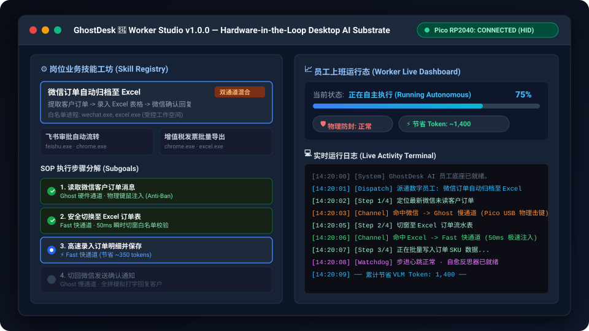
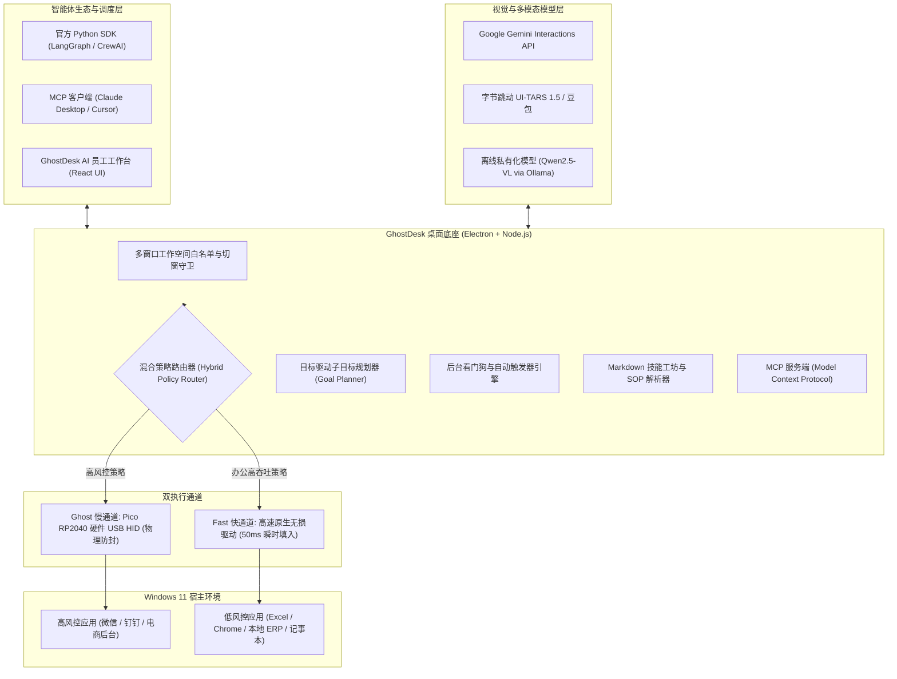

# GhostDesk 👻🖥️⚡

> **攻壳机动队式软硬协同·物理级防封的桌面 AI 员工开源底座 (支持 Windows 与 macOS)**  
> *The Open-Source Hardware-in-the-Loop Desktop AI Employee Substrate for Windows & macOS*

[](LICENSE)
[](https://github.com/AIMarshallLee/GhostDesk)
[](https://github.com/AIMarshallLee/GhostDesk/actions/workflows/ci.yml)
[](firmware/)
[](https://ai.google.dev/)
[](https://modelcontextprotocol.io/)
[](sdk/python/)

[English](README.md) | [中文说明](README_CN.md)

<p align="center">
  
</p>

---

## 💡 为什么需要 GhostDesk？

目前主流的桌面自动化与 Computer Use 方案（如 PyAutoGUI、Windows UI Automation、系统级键盘鼠标模拟钩子），本质上全是**软件层面的 API 注入**。

当企业尝试使用 AI 自动化操作敏感业务软件（如微信、企微、钉钉、千牛、电商后台、各类 ERP 与网银）时，此类软件注入行为会在几秒钟内被平台反作弊与风控系统捕获，**导致批量封号与封禁**。

**GhostDesk（意为“驻留在桌面硬件躯壳中的 AI 幽灵”）从底层采用了完全不同的真实生产级解法：**

1. 🛡️ **物理级硬件 HID 仿真（树莓派 Pico RP2040）**：AI 的鼠标移动与按键通过外接硬件芯片（运行定制 TinyUSB 固件）下发。在 Windows 与目标软件看来，这就是一个完全合法的外部物理键盘与鼠标。**零软件注入钩子，平台风控 100% 无法探查。**
2. ⚡ **快慢双通道混合执行（Hybrid Execution）**：
   - **Ghost 慢通道**：高风控软件（微信、企微、电商）强制走 Pico 物理防封击键 + 视觉感知全拼打字。
   - **Fast 快通道**：低风控办公软件（Excel、Chrome、记事本）启用高速原生无损输入，打字延迟从 15 秒缩短至 50 毫秒，节省约 80% VLM Token！
3. 🔒 **100% 离线私有化视觉模型适配（Qwen2.5-VL / Ollama）**：支持本地离线运行 Qwen2.5-VL，内置 0-1000 归一化坐标转换与指令解析。数据不出内网，彻底解决企业隐私与安全合规痛点。
4. 🐍 **官方 Python SDK (`ghostdesk`)**：原生支持 **LangGraph**、**CrewAI**、**AutoGen** 与 LangChain 智能体，提供完整强类型 Pydantic 模型与即开即用示例。
5. 📑 **Markdown SOP 社区技能工坊（Skill Hub）**：无需写代码，用 Markdown 格式即可定义多软件联动工作流！内置《飞书审批自动流转》、《增值税发票批量导出》、《小红书意向线索归档》、《微信订单自动同步 Excel》等开箱即用 SOP。
6. 🤖 **AI 员工工作台（Worker Studio）与自愈看门狗**：可视化 React 仪表盘，支持实时进度监控、Token 节省统计、定时轮询与文件监听触发器，以及遭遇意外弹窗阻挡时的 `ESC` 自动自愈。
7. 🔌 **标准 MCP 工具服务（Model Context Protocol）**：内置 `ghostdesk_act`、`ghostdesk_switch_focus`、`ghostdesk_list_workspace_windows` 等标准工具，供 Claude Desktop、Cursor 及外部任意大模型 Agent 直接调用。

---

## 🏗️ 系统架构



---

## ⚡ 快速上手

### 1. 环境准备
- 操作系统：Windows 11 x64
- 运行时：Node.js v20+ / npm v10+
- Python（可选，用于运行 Python SDK）：Python 3.10+
- *(可选硬件)*：树莓派 Pico 1（RP2040 核心板，淘宝约 15~20 元）+ Micro-USB 数据线

### 2. 安装与运行测试
```powershell
# 克隆仓库
git clone https://github.com/AIMarshallLee/GhostDesk.git
cd GhostDesk

# 安装依赖
npm ci

# 运行自动化测试套件 (43+ 底座单元测试)
npm test
```

### 3. 启动底座
- **AI 员工工作台 (桌面客户端)**：
  ```powershell
  npm run desktop
  ```
- **纯软件免硬件开发者模式**：
  ```powershell
  $env:FLOWDESK_DEV_MODE="1"; npm run desktop
  ```
- **启动标准 MCP 服务**：
  ```powershell
  npx tsx desktop/mcp-server.ts
  ```

---

## 🐍 Python SDK 快速接入 (LangGraph & CrewAI)

安装 Python SDK：
```powershell
cd sdk/python
pip install -e .
```

### 基础调用示例
```python
from ghostdesk import GhostClient, WindowTarget

client = GhostClient(base_url="http://127.0.0.1:4318")

# 1. 高风控软件：自动路由至 Pico 硬件 USB HID 键鼠通道，零封号风险
res = client.execute_action(process="wechat.exe", kind="type_text", text="订单已发货！")
print(f"执行通道: {res.channel}")  # -> 'ghost'

# 2. 安全办公软件：自动路由至 Fast 极速通道 (50ms 原生无损填入)
res = client.execute_action(process="excel.exe", kind="click", x=120.0, y=85.0)
print(f"执行通道: {res.channel}")  # -> 'fast'

# 3. 调度端到端 SOP 技能
res = client.dispatch_skill(
    skill_id="skill_order_to_excel",
    target_windows=[
        WindowTarget(hwnd="0x001A", process="wechat.exe", title="微信"),
        WindowTarget(hwnd="0x002B", process="excel.exe", title="订单汇总.xlsx"),
    ]
)
```

查看 [sdk/python/examples/](sdk/python/examples/) 获取完整的 **LangGraph** 与 **CrewAI** 自动化智能体集成代码。

---

## 📑 Markdown 社区技能工坊 (Skill Hub)

无需编写任何底层代码，只需写一份标准的 Markdown SOP 即可被底座直接加载调度：

```markdown
---
id: skill_vat_export
name: 增值税发票批量下载导出
processes: [chrome.exe, excel.exe]
---

### Step 1: 检索发票明细
- Target: chrome.exe
- Channel: fast
- Action: 点击【已开具发票查询】，选择上月区间并点击【查询】
- Expect: 表格渲染出查询结果列表

### Step 2: 批量下载与 Excel 格式化
- Target: chrome.exe
- Channel: ghost
- Action: 勾选全选，点击【批量下载】，保存至本地 Downloads
- Expect: 文件下载完成
```

将文件放入 `skills/` 目录，GhostDesk 会自动发现、校验并注册到可用技能列表中。

---

## 🔌 硬件极速烧录 (30 秒搞定)

GhostDesk 支持两种高可靠硬件方案：

### 方案 A：极简高性价比方案 —— 树莓派 Pico 1 (RP2040，约 15~20 元)
1. 按住 Pico 板上的白色 **BOOTSEL** 按键，插上 USB 数据线连接电脑。
2. 电脑会自动弹出一个名为 `RPI-RP2` 的可移动磁盘。
3. 将本项目下的 `firmware/release/flowdesk_usb_bridge.uf2` 文件直接拖拽粘贴进该磁盘。
4. Pico 自动重启，瞬间变身为合法的标准外部硬件 HID 键盘鼠标！

### 方案 B：高端全彩触控带屏方案 —— M5Stack CoreS3 (ESP32-S3)
> 拥有 2.0 寸全彩触控屏、声音报警与**物理急停按钮 (Kill Switch)**，AI 暴走误操作一触即停！
1. **浏览器一键烧录 (Web Flasher)**：使用 Chrome / Edge 浏览器打开 [firmware/m5stack_cores3/web_flasher.html](firmware/m5stack_cores3/web_flasher.html)，插上 CoreS3 点击“安装固件”即可秒级完成烧录。
2. **源码编译烧录**：支持 VS Code + PlatformIO / Arduino IDE 一键编译烧录（详见 [firmware/m5stack_cores3/README.md](firmware/m5stack_cores3/README.md)）。
3. 烧录完成后，CoreS3 屏幕将实时显示 AI 动作日志、心跳租约以及底部物理急停大红钮。

设备连接后，在 GhostDesk 客户端中打开 **USB 硬件控制**，设备即可秒级自动连接识别。

---

## 🗺️ 演进路线图

- [x] **v0.8.0 (底座里程碑 1)**:
  - **快慢双通道混合执行引擎**: Fast 极速通道 (50ms) + Ghost 硬件防封慢通道
  - **多窗口工作空间白名单守卫**: HWND 范围受控切窗与异常熔断
  - **标准 MCP 服务端**: 对接外部各种 Agent 调用的标准化工具集
- [x] **v0.9.0 (底座里程碑 2)**:
  - **目标驱动子任务规划器**: 步骤拆解与完成进度百分比追踪
  - **视觉自我反思引擎**: 动作前后状态核验与画面死锁检测
  - **全自动自愈机制**: 阻挡弹窗自动触发 `ESC` 中立态恢复
- [x] **v1.0.0 (护城河全量发布 - 已完成)**:
  - **AI 员工工作台 (Worker Studio UI)**: 任务派发与 Token 节省可视化大盘
  - **无人值守自动化看门狗与触发器**: 定时轮询与文件夹变动自动派工
  - **官方 Python SDK**: 原生支持 LangGraph 与 CrewAI 多智能体系统
  - **本地离线私有化 VLM 适配**: 零数据出境的 Qwen2.5-VL 离线视觉模型
  - **Markdown 社区技能工坊**: 人人可编的标准化 SOP 解析与执行底座
- [ ] **v1.1.0 (多机硬件集群调度)**:
  - 多口 USB Hub 阵列支持，单宿主机多 Dongle 并行多任务派发

---

## 🤝 贡献与开源协议

欢迎社区提交 Issue 与 Pull Request！

本项目采用 **Apache License 2.0** 开源协议 - 详见 [LICENSE](LICENSE) 文件。  
固件部分基于 TinyUSB 实现，遵循 MIT/BSD 协议（详见 `firmware/licenses`）。
