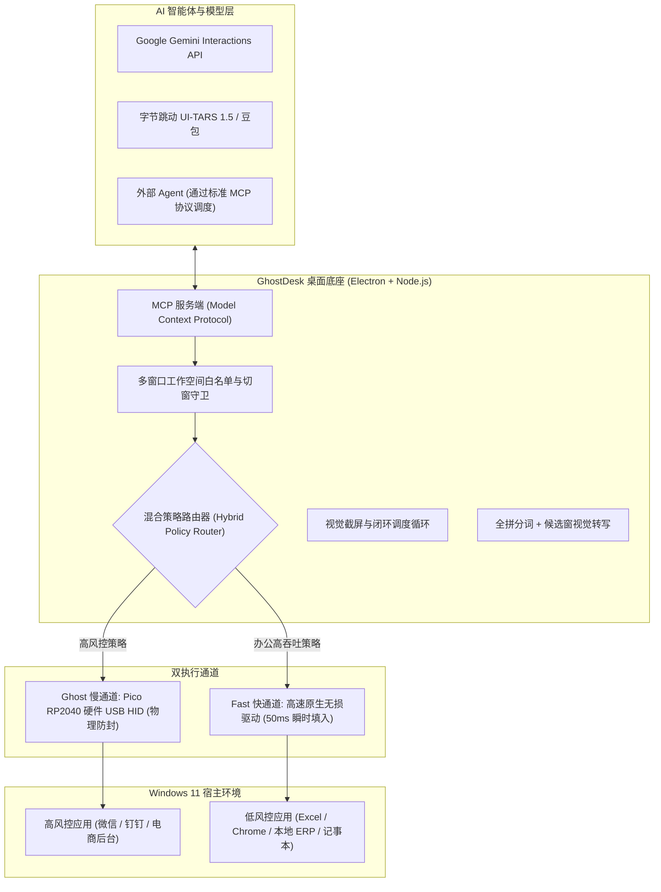

# GhostDesk 👻🖥️⚡

> **攻壳机动队式软硬协同·物理级防封的桌面 AI 员工开源底座 (Windows)**  
> *The Open-Source Hardware-in-the-Loop Desktop AI Employee Substrate*

[](LICENSE)
[](https://www.microsoft.com/windows)
[](https://www.raspberrypi.com/products/raspberry-pi-pico/)
[](https://ai.google.dev/)

[English](README.md) | [中文说明](README_CN.md)

---

## 💡 为什么需要 GhostDesk？

目前主流的桌面自动化与 Computer Use 方案（如 PyAutoGUI、Windows UI Automation、系统级键盘鼠标模拟钩子），本质上全是**软件层面的 API 注入**。

当企业尝试使用 AI 自动化操作敏感业务软件（如微信、企微、钉钉、千牛、电商后台、各类 ERP 与网银）时，此类软件注入行为会在几秒钟内被平台反作弊与风控系统捕获，**导致批量封号与封禁**。

**GhostDesk（意为“驻留在桌面硬件躯壳中的 AI 幽灵”）从底层采用了完全不同的真实生产级解法：**
1. **物理级硬件 HID 仿真（树莓派 Pico RP2040）**：AI 的鼠标移动与按键通过外接硬件芯片（运行定制 TinyUSB 固件）下发。在 Windows 与目标软件看来，这就是一个完全合法的外部物理键盘与鼠标。
2. **视觉感知驱动的输入法全拼打字**：中文不走剪贴板、不产生 `Ctrl+V` 特征，由 `pinyin-pro` 将中文转为全拼 ASCII 击键下发，同时配合视觉模型毫秒级读取输入法候选框并按下数字选词。
3. **快慢双通道混合执行（Hybrid Execution）**：
   - **Ghost 慢通道**：高风控软件（微信、企微、电商）强制走 Pico 物理防封击键。
   - **Fast 快通道**：低风控办公软件（Excel、Chrome、记事本）启用高速原生无损输入，打字延迟从 15 秒缩短至 50 毫秒，节省约 80% VLM Token！
4. **受控多窗口工作空间（Multi-Window Workspace）**：打破单窗口死锁，支持 AI 员工在授权的白名单窗口集合（如微信 + Chrome + Excel）间安全切窗协同，未知弹窗立即熔断。
5. **标准 MCP 工具服务（Model Context Protocol）**：内置 `ghostdesk_act`、`ghostdesk_switch_focus`、`ghostdesk_list_workspace_windows` 等标准工具，供外部各种大模型 Agent 直接调度。
6. **双前沿视觉 Computer Use 引擎**：
   - 官方原生 **Google Gemini Interactions** 桌面端操作协议。
   - 国内与开源前沿 **字节跳动 UI-TARS 1.5** / 豆包 Computer Use 模型。

---

## 🏗️ 系统架构



---

## ⚡ 快速上手

### 1. 环境准备
- 操作系统：Windows 11 x64
- 运行时：Node.js v20+ / npm v10+
- *(可选)*：树莓派 Pico 1（RP2040 核心板，淘宝约 15~20 元）+ Micro-USB 数据线

### 2. 获取代码与依赖安装
```powershell
# 克隆仓库
git clone https://github.com/AIMarshallLee/GhostDesk.git
cd GhostDesk

# 安装依赖
npm ci

# 执行全套自动化单元测试（230+ 测试项）
npm test
```

### 3. 运行体验
- **启动网页工作台 (Web Studio)**：
  ```powershell
  npm run dev
  # 浏览器访问 http://127.0.0.1:5178
  ```
- **启动 Windows 客户端 (Electron)**：
  ```powershell
  npm run desktop
  ```
- **免硬件开发者模式 (Software-Only)**：
  ```powershell
  $env:FLOWDESK_DEV_MODE="1"; npm run desktop
  ```

---

## 🔌 硬件烧录指南（30 秒免工具搞定）

GhostDesk 采用极其普及的 **树莓派 Pico 1 (RP2040)**：
1. 按住 Pico 板子上的 **BOOTSEL** 白色小按键不放，插上电脑 USB。
2. 电脑会自动弹出一个名为 `RPI-RP2` 的 U 盘驱动器。
3. 将本项目自带的预编译固件 `firmware/release/flowdesk_usb_bridge.uf2` 拖入该 U 盘。
4. 板子会自动重启，瞬间变身 GhostDesk 硬件键鼠控制器！
5. 在 GhostDesk 客户端中打开「USB 硬件」页面，系统将自动识别该设备。

---

## 🗺️ 演进路线图：向全能 AI 员工底座全面迈进

- [x] **v0.7.0 (核心基线)**：
  - Gemini 原生 Interactions Computer Use 支持
  - UI-TARS 1.5 单任务视觉规划与操作
  - 树莓派 Pico USB HID 协议 4 与心跳看门狗
  - 中文视觉输入法全拼逐键打字
- [x] **v0.8.0 (底座第一里程碑 - 现已落地！)**：
  - **快慢双通道混合执行引擎**：Fast 通道（50ms 瞬时打字）+ Ghost 通道（Pico 硬件防封）
  - **受控多窗口工作空间管理器**：白名单 HWND 校验与安全切窗守卫
  - **Model Context Protocol (MCP) 服务端**：提供跨 Agent 调度的标准工具接口
- [ ] **v0.9.0 (数字员工技能生态与规划器)**：
  - 模块化技能系统（Excel 批量核对、发票开具、多标签浏览器抓取、ERP 跨系统录入）
  - 长周期目标规划与反思纠错状态机（Self-Reflection Engine）
- [ ] **v1.0.0 (企业级分布式员工集群)**：
  - 支持单台管理服务器统筹多台插着硬件狗的“AI 员工工控机”集中调度看板

---

## 🤝 贡献与开源许可

欢迎提交 Issue 和 Pull Request！

本项目代码遵循 **Apache License 2.0** 开源许可协议 - 详见 [LICENSE](LICENSE)。  
固件部分包含 TinyUSB 开源组件，遵循 MIT/BSD-3-Clause 协议。
