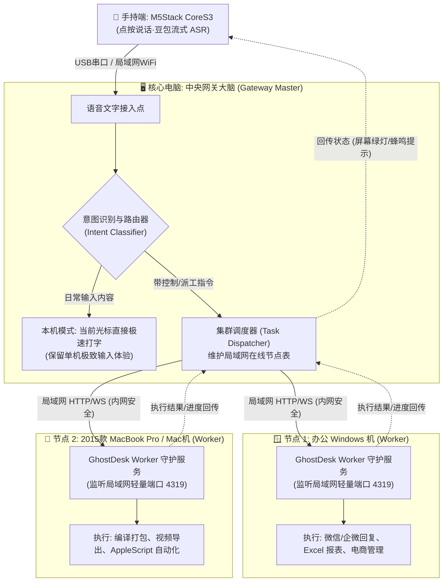

# GhostDesk 多机智能蜂群协同架构与实机落地指南

> **核心目标**：实现「手中 1 个 CoreS3 硬件对讲机 + 1 台中央网关电脑大模型调度 + 多台 Windows / Mac 电脑局域网并行干活」的完整闭环。

---

## 🏗️ 架构拓扑与数据流向

---

## 📦 各台电脑具体发什么（傻瓜式即拷即用清单）

为了让不同机器“开箱即用”，每台机器**各司其职、文件极其纯粹**：

### 1. 核心主机（中央网关大脑，即当前这台高性能 Windows 开发机）
- **角色**：连接 CoreS3 硬件，充当中央调度大脑与本地输入主力。
- **需要运行**：
  - `dist/GhostDesk.exe`（现有的监听端）
  - 启动增强模式的网关调度模块 `ghostdesk_gateway.py`（负责监听内网 Worker 注册与派工）。
- **配置**：保持当前的 `volc_config.json`（自带豆包大模型流式识别）。

---

### 2. 发给“另一台 Windows 办公机”的包
- **打包文件**：直接发桌面已生成的 `GhostDesk-另一台Windows专属免配置包.zip`。
- **解压后包含 4 个文件**：
  1. `GhostDesk.exe`（免安装单文件）
  2. `一键安装开机后台静默自启.bat`（双击后，每次开机自动在后台常驻等待主控机派活）
  3. `一键停止后台守护.bat`
  4. `README_Windows.txt`
- **使用体验**：
  - 微信或 U 盘拷过去，解压到一个固定目录（如 `D:\GhostDesk`）；
  - 双击 `一键安装开机后台静默自启.bat`，之后**完全不用再管它**，没有黑窗口干扰正常办公；
  - 以后无论是给它连 USB 硬件独立使用，还是接收主控机的自动化控制，都能无缝执行。

---

### 3. 发给“2015 款 MacBook Pro”的包
- **打包文件**：直接发桌面已生成的 `GhostDesk-Mac专属免配置包.zip`。
- **解压后包含的文件**：
  1. `start_mac.command`（双击即启动 Worker 代理）
  2. `scripts/`（轻量执行脚本库）
  3. `README_macOS.txt`
- **使用体验**：
  - 微信发到 2015 款 MacBook Pro，解压到某个文件夹；
  - 双击 `start_mac.command`，终端会自动检测 Python 环境；
  - 首次运行时在【系统偏好设置 -> 隐私与安全性 -> 辅助功能】中勾选允许终端即可；
  - 它不仅能独立插 CoreS3 体验打字，也能随时作为 Worker 接收来自主控机的派发任务。

---

## 🛠️ 关键细节与设计方案（怎样做最稳、不添乱）

### 细节 1：意图分流算法（如何区分是“日常打字”还是“给其他机器下命令”？）
如果每次说话都要做复杂的思考，打字延迟就会变高。因此采用**快慢双分支路由**：
- **分支 A（纯打字模式 - 0ms 延迟）**：
  - 默认行为。只要你没明确指定机器或指令，你说什么，当前光标处就打什么，绝不改变现有极速体验。
- **分支 B（派工指令模式）**：
  - 只要触发特定前缀关键词（可自然口语）：
    - *“给 Mac 发任务：xxxx”*
    - *“办公机：把今天的报表导出来”*
    - *“所有电脑：锁屏 / 休眠”*
    - *“电脑，执行：打开微信给张总发消息”*
  - 中央网关的大模型在 300ms 内提取意图，不往当前屏幕打字，而是转成结构化任务 JSON 扔给目标机器。

### 细节 2：局域网免配置自组网（无需手动查每台电脑的 IP）
- 采用 **UDP 广播探查（Zero-Config LAN Discovery）**：
  - 任何一台电脑只要启动了 Worker，就会在局域网内广播一段握手信号 `GhostDesk:Hello:MacBook`；
  - 中央主控机收到后自动将这台机器列入“可用设备池”；
  - 即使路由器经常变动 IP，也能秒级自动重连，无需用户改任何配置文件。

### 细节 3：任务执行结果的闭环反馈（如何知道活干完没有？）
- 任务执行完毕后，目标机器向中央主机回传结果（例如 `status: success, message: "报表已导出至桌面"`）；
- 主机中央网关通过 USB CDC / BLE 发送控制包给 CoreS3；
- **CoreS3 屏幕反馈**：
  - 屏幕右上角显示微型指示灯：🟢 Mac 就绪 | 🟢 Win 办公机就绪；
  - 任务完成时，CoreS3 屏幕弹出绿色通知卡片，蜂鸣器轻响一声“叮”，让你脱离电脑也能心中有数。

---

## 📅 分阶段实施计划

- **阶段一（即刻可做·多端环境跑通）**：
  - 把已打包好的 Windows 包发给另一台 Windows；
  - 把 Mac 包发给 2015 款 MacBook Pro；
  - 验证两台机器各自单独作为独立终端打字与接收的稳定度。
- **阶段二（中枢通信·局域网握手）**：
  - 为两台从机编写极简的局域网探查与 Worker 插件；
  - 实现主控机上执行 `ping_all_workers` 能看到另外两台机器在线。
- **阶段三（智能语音派工·多机联动）**：
  - 接入 CoreS3 语音指令解析，一句语音，主控调度，从机并发执行！
