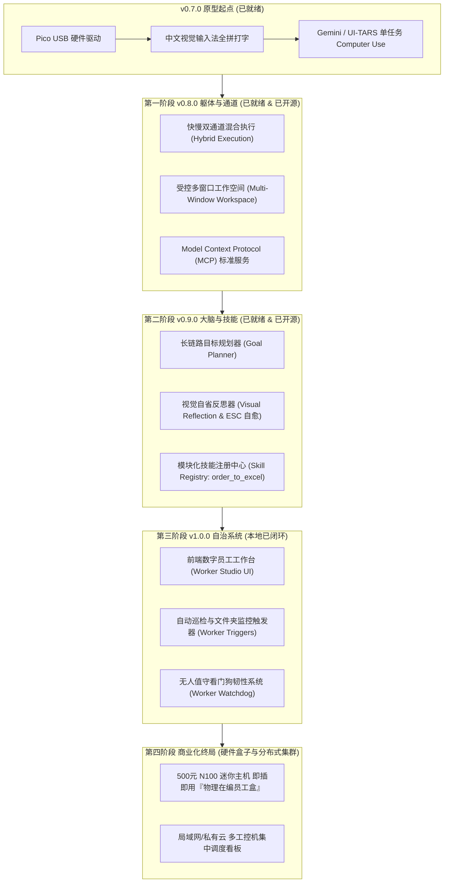

# GhostDesk 👻 物理级防封桌面 AI 员工底座 · 终极总规划方案

> **定位**：The Open-Source Hardware-in-the-Loop Desktop AI Employee Substrate for Windows  
> **开源协议**：Apache License 2.0  
> **开源仓库**：https://github.com/AIMarshallLee/GhostDesk  
> **本地开发目录**：`E:\Obsidian\产品与技术\FlowDesk`（双轨物理隔离，100% 私密安全）

---

## 一、 为什么我们能成为“AI 员工底座”？（核心护城河）

市面上做 AI 员工/Agent 的成百上千，但绝大多数无法在企业真实业务中落地：
1. **Prompt/API 框架（CrewAI / AutoGen / LangGraph）**：仅在黑盒控制台调 API，碰不到真实的桌面应用（微信、ERP、银行软件）。
2. **网页端自动化（Browser-Use / Stagehand）**：只能点击浏览器 DOM，碰不到本地客户端软件。
3. **纯软件注入 Computer Use（Anthropic / UI-TARS Desktop / Windows-MCP）**：全部依赖 `SendInput`、系统钩子或 UIA 注入，在微信、企微、千牛、拼多多、网银等高风控系统面前，**一秒被识别为外挂，导致批量封号**。

### 我们的独家立足点（不可替代性）：
> **我们不解决“AI 怎么思考”（那是大模型厂商的事），我们独家解决了“AI 在真实 Windows 复杂对抗环境下，如何拥有一具绝对合法的物理躯壳（硬件键鼠 + 视觉眼睛）去安全干活”。**

- **物理 USB 硬件 HID 在环（树莓派 Pico RP2040）**：外部芯片模拟真实键鼠，系统和应用底层感知为合法物理硬件。
- **全拼逐键输入 + 视觉 OCR 读候选框**：不调用系统剪贴板，不产生 `Ctrl+V` 外挂特征。
- **Fail-Closed 银行级安全边界**：强校验 HWND、PID、进程启动时间，严防切窗误触与越界操作。

---

## 二、 弥补差距的四大演进阶段（Roadmap 全景）

---

## 三、 阶段落地与当前状态对照表

| 阶段版本 | 核心目标 | 包含的关键硬核模块 | 当前状态 |
| :--- | :--- | :--- | :--- |
| **v0.7.0** 核心原型 | 解决物理硬件仿真打字 | • RP2040 Pico TinyUSB 固件协议 4 • `pinyin-pro` + 视觉 OCR 读候选框打字 • safeStorage 密钥安全存储与单窗口锁定 | ✅ **100% 完成** |
| **v0.8.0** 混合底座 | 解决“又慢又贵”与“单窗口死锁” | • **快慢双通道（Hybrid Executor）**：高危应用走 Pico 硬件，办公走 50ms 高速无损录入（省 80% Token） • **受控多窗口工作空间（Workspace Manager）**：白名单自由切窗，防漂移熔断 • **行业标准 MCP 服务端**：暴露 4 项工具供外部 Agent 调度 | ✅ **100% 完成** *(已推送到 GitHub)* |
| **v0.9.0** 业务大脑 | 解决长链路规划、弹窗卡死与技能扩展 | • **目标分解规划器（Goal Planner）**：子目标推进栈与进度监控 • **视觉自愈反思器（Self-Reflection）**：连续 2 轮卡死自动触发 `ESC` 关弹窗自愈 • **模块化技能中心（Skill Registry）**：内置跨软件标杆 SOP `order_to_excel` | ✅ **100% 完成** *(已推送到 GitHub)* |
| **v1.0.0** 自治系统 | 解决开箱即用、自动上班与无人值守 | • **前端「数字员工管理中心（Worker Studio）」**：可视化选技能、派员工、看进度 • **自主巡检与文件监控触发器（Triggers）**：每隔 5 分钟巡检微信/监控发票目录 • **无人值守看门狗（Watchdog）**：执行心跳超时自动自愈，防进程僵死 | ✅ **本地测试 100% 通过** *(本地 Git 已提交，待静默自动推送)* |
| **未来阶段** 商业闭环 | 软硬件结合与规模化企业变现 | • **即插即用预刷固件 USB 硬件狗周边销售** • **500 元迷你主机『物理 AI 员工盒子』整机交付** • **企业级分布式集群调度看板**（管理几十台工控机数字员工） | ⏳ **规划储备** |

---

## 四、 双轨工作流机制（永不混乱）

1. **本地开发（绝对私密）**：
   - 路径：`E:\Obsidian\产品与技术\FlowDesk`
   - 日常开发、私有数据、实机测试日志全部留在本地，不连接任何公开远程。
2. **开源发布（干净纯粹）**：
   - 路径：`E:\GhostDesk`
   - 通过 `powershell -File scripts/export-opensource.ps1` 一键脱敏导出，自动剔除日志缓存。
3. **推送节奏策略**：
   - 阶段开发在本地稳扎稳打；
   - 阶段测试完成且用户静默（或明确指示）时，一键同步上云。
